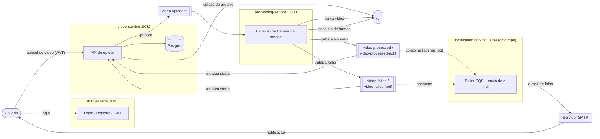
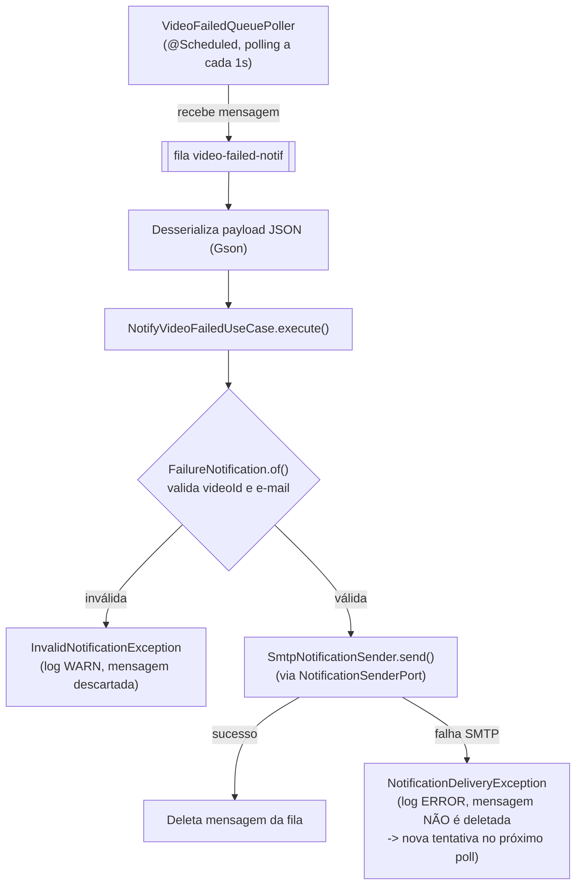
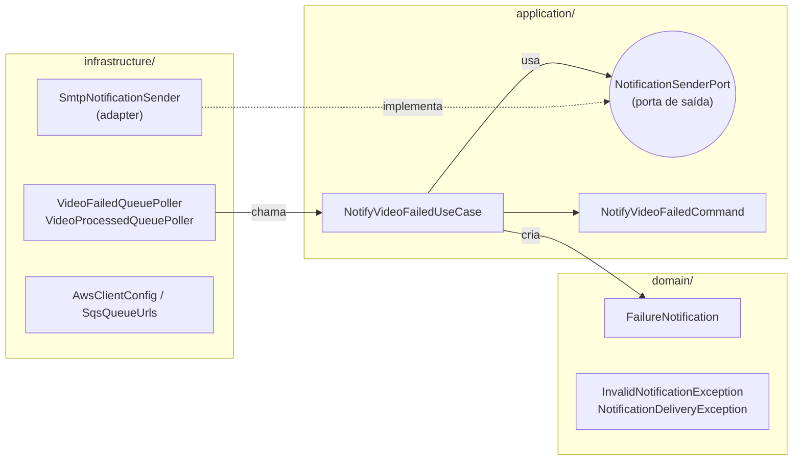
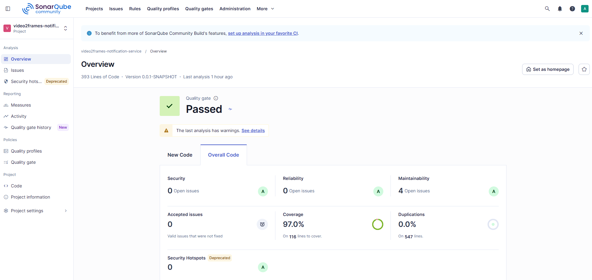

# video2frames-notification-service

Microsserviço de notificação do sistema **Video2Frames** — projeto da Pós-Tech Fase 05, uma pipeline que recebe upload de vídeos, extrai frames via `ffmpeg` e notifica o usuário sobre o resultado do processamento.

Este serviço é o **worker de notificações**: não expõe nenhuma API REST de negócio (apenas endpoints do Actuator). Ele roda de forma passiva, consumindo filas SQS, e é responsável por avisar o usuário por e-mail quando o processamento do vídeo dele falha.

## Papel no pipeline Video2Frames

O sistema é composto por 4 microsserviços independentes, cada um em seu próprio repositório:

| Serviço | Porta | Responsabilidade |
|---|---|---|
| `video2frames-auth-service` | 8081 | Cadastro/login de usuários, emissão e refresh de JWT |
| `video2frames-video-service` | 8082 | API de upload de vídeo (protegida por JWT), persiste metadados em Postgres, envia o arquivo ao S3, publica em `video-uploaded` |
| `video2frames-processing-service` | 8083 | Consome `video-uploaded`, baixa o vídeo do S3, extrai frames com `ffmpeg`, zipa e sobe o resultado ao S3, publica em `video-processed`/`video-processed-notif` (sucesso) ou `video-failed`/`video-failed-notif` (falha) |
| **`video2frames-notification-service`** (este repo) | 8084 | Consome `video-failed-notif` e envia e-mail de falha ao usuário via SMTP; consome `video-processed-notif` apenas para registro (log), sem envio de e-mail |

### Diagrama geral do pipeline



### Fluxo interno deste serviço



### Arquitetura hexagonal



O `NotifyVideoFailedUseCase` (camada de aplicação) não conhece detalhes de e-mail ou SQS — depende apenas da porta `NotificationSenderPort`. Trocar o canal de notificação (SMS, push, Slack) exigiria apenas um novo adapter em `infrastructure/`, sem alterar `application/` ou `domain/`.

## Filas consumidas

Configuradas em `application.yml` (nomes reais, sobrescrevíveis por variável de ambiente):

| Fila | Variável de ambiente | Uso |
|---|---|---|
| `video-processed-notif` | `SQS_VIDEO_PROCESSED_QUEUE` | Consumida apenas para log/observabilidade — **não gera e-mail hoje** (ver "Possíveis melhorias" abaixo) |
| `video-failed-notif` | `SQS_VIDEO_FAILED_QUEUE` | Consumida e processada pelo `NotifyVideoFailedUseCase`, dispara e-mail de falha ao usuário |

Ambos os pollers rodam com `@Scheduled(fixedDelay = 1000)` (polling a cada 1s, `long-polling` de até 10s por chamada ao SQS via `aws.sqs.poll-wait-time-seconds`).

Cada fila tem uma DLQ companion (`<fila>-dlq`, `maxReceiveCount=3`) provisionada em `video2frames-infra-ops` — mensagens que falham repetidamente (ex: JSON malformado, ou falha persistente de SMTP) vão parar lá em vez de reprocessar para sempre. Ver [documentação de arquitetura](../video2frames-infra-ops/docs/arquitetura.md#resiliência-das-filas-dead-letter-queue-dlq).

## Tech stack

- Java 17
- Spring Boot 4.1 (Spring Web só para expor o Actuator; Spring Mail para SMTP)
- AWS SDK v2 (SQS)
- Lombok (`@Slf4j` para logging)
- Gson (desserialização das mensagens da fila)
- JUnit 5 + Mockito + AssertJ (testes)
- Micrometer + Prometheus registry (métricas)
- Docker / Docker Compose + LocalStack (ambiente local)

## Como rodar localmente

Pré-requisito: Docker e Docker Compose instalados.

O LocalStack (S3 + SQS) usado por este serviço é **compartilhado** com `video-service` e `processing-service` — ele mora no repositório irmão `video2frames-infra-ops`, que precisa subir primeiro:

```bash
cd ../video2frames-infra-ops
docker compose up -d
```

Depois, neste repositório:

```bash
docker compose up -d
```

Isso sobe este serviço, já compilado via Dockerfile multi-stage, na porta `8084`, apontando `AWS_ENDPOINT_OVERRIDE` para o LocalStack compartilhado (`video2frames-localstack:4566`, via a rede Docker externa `video2frames-net`).

> Se aparecer o erro `network video2frames-net declared as external, but could not be found`, é porque o `video2frames-infra-ops` ainda não foi iniciado — suba-o primeiro.

Para rodar apenas a aplicação localmente (fora de container), com JDK 17 instalado:

```bash
./mvnw spring-boot:run
```

Nesse caso é preciso ter um SQS acessível (real ou LocalStack rodando à parte) e credenciais SMTP válidas nas variáveis de ambiente.

## Variáveis de ambiente

| Variável | Padrão (dev) | Descrição |
|---|---|---|
| `SERVER_PORT` | `8084` | Porta HTTP (apenas Actuator) |
| `SMTP_HOST` | `smtp.gmail.com` | Host do servidor SMTP |
| `SMTP_PORT` | `587` | Porta SMTP |
| `SMTP_USERNAME` | conta Gmail de teste compartilhada | Usuário SMTP |
| `SMTP_PASSWORD` | senha de app da conta de teste | Senha/app-password SMTP |
| `AWS_REGION` | `us-east-1` | Região AWS para o cliente SQS |
| `AWS_ENDPOINT_OVERRIDE` | `http://localhost:4566` | Endpoint alternativo (LocalStack); vazio para usar o endpoint padrão da AWS |
| `AWS_ACCESS_KEY_ID` | `test` | Access key (fake para LocalStack) |
| `AWS_SECRET_ACCESS_KEY` | `test` | Secret key (fake para LocalStack) |
| `SQS_VIDEO_PROCESSED_QUEUE` | `video-processed-notif` | Nome da fila de sucesso |
| `SQS_VIDEO_FAILED_QUEUE` | `video-failed-notif` | Nome da fila de falha |
| `NOTIFICATION_FROM_ADDRESS` | `no-reply@video2frames.com` | Endereço remetente do e-mail |
| `NOTIFICATION_FROM_NAME` | `Video2Frames` | Nome de exibição do remetente |
| `LOG_LEVEL` | `INFO` | Nível de log do pacote `br.com.video2frames` |
| `LOG_LEVEL_ROOT` | `INFO` | Nível de log raiz |
| `LOG_FORMAT` | *(vazio)* | Formato dos logs de console (`ecs` para JSON estruturado — ver seção "Logging") |

> **Atenção:** os valores padrão de `SMTP_USERNAME`/`SMTP_PASSWORD` em `application.yml` apontam para uma conta Gmail de teste compartilhada, usada apenas para desenvolvimento local e demonstração. Em qualquer ambiente real (staging/produção), essas credenciais **devem sempre ser sobrescritas** por variáveis de ambiente próprias, nunca commitadas em texto claro.

## Testes

O serviço tem 24 testes unitários (JUnit 5 + Mockito + AssertJ, nomeados em português no padrão `metodo_quandoX_resultado`), cobrindo casos de uso, adapters (SMTP, pollers SQS) e modelo de domínio.

```bash
./mvnw test
```

O relatório de cobertura (JaCoCo) é gerado em `target/site/jacoco/jacoco.xml` durante a fase `test`. Cobertura atual: **97%**.

## Logging

Este serviço usa o suporte nativo de **structured logging** do Spring Boot 4 (sem dependências extras, tipo Logback encoder customizado). O comportamento é controlado pela variável `LOG_FORMAT`:

- **Vazio/não definido (padrão em dev):** logs em texto plano no console, mais fáceis de ler durante desenvolvimento.
- **`LOG_FORMAT=ecs`:** logs em JSON no formato ECS (Elastic Common Schema) — pensado para ambientes de staging/produção, prontos para serem ingeridos por AWS CloudWatch Logs, ELK/Elasticsearch ou qualquer coletor que entenda JSON, sem precisar tocar em código.

As classes de negócio (`NotifyVideoFailedUseCase`, `SmtpNotificationSender`, pollers SQS, `SqsQueueUrls`, `AwsClientConfig`) usam `@Slf4j` (Lombok) e logam em:
- **INFO** para eventos relevantes de negócio (recebimento de mensagem, envio de e-mail, resolução de fila);
- **WARN** para rejeições de domínio esperadas (ex.: notificação inválida);
- **ERROR** para falhas reais de infraestrutura (ex.: erro de envio SMTP), sempre com a exception anexada.

Nenhum log inclui credenciais SMTP ou corpo completo de e-mail — apenas identificadores (id do vídeo, e-mail do destinatário) necessários para rastreabilidade operacional.

## Monitoramento / Observabilidade

O serviço expõe, via Spring Boot Actuator:

- `GET /actuator/health` — health check;
- `GET /actuator/prometheus` — métricas no formato Prometheus (via `micrometer-registry-prometheus`);
- `GET /actuator/info`, `GET /actuator/metrics` — informações e métricas adicionais.

Não há autenticação nesses endpoints, pois este serviço não usa Spring Security.

Para visualizar métricas e dashboards ao vivo dos 4 serviços do Video2Frames, use o stack compartilhado do repositório **`video2frames-infra-ops`**: um `docker-compose` com Prometheus (fazendo scrape de `/actuator/prometheus` de todos os serviços via `host.docker.internal`) e Grafana, com o dashboard pré-provisionado **"Video2Frames - Overview"**.

## Qualidade de código (SonarQube)

Análise local rodada contra este código, com **Quality Gate: Passed**:

| Métrica | Valor |
|---|---|
| Linhas de código | 393 |
| Cobertura | 97,0% |
| Bugs | 0 (Reliability rating A) |
| Vulnerabilidades | 0 (Security rating A) |
| Code Smells | 4 (Maintainability rating A) |
| Linhas duplicadas | 0,0% |



Para reproduzir a análise localmente (requer um SonarQube rodando em `localhost:9000` e um token de projeto):

```bash
./mvnw test org.sonarsource.scanner.maven:sonar-maven-plugin:sonar -Dsonar.projectKey=video2frames-notification-service -Dsonar.host.url=http://localhost:9000 -Dsonar.token=<seu-token> -Dsonar.coverage.jacoco.xmlReportPaths=target/site/jacoco/jacoco.xml
```

## Possíveis melhorias futuras

- Hoje, `video-processed-notif` é consumida apenas para log (`VideoProcessedQueuePoller`), sem gerar nenhum e-mail de sucesso ao usuário. Um `NotifyVideoSucceededUseCase` análogo ao de falha poderia ser adicionado seguindo o mesmo padrão de portas/adapters já existente.
